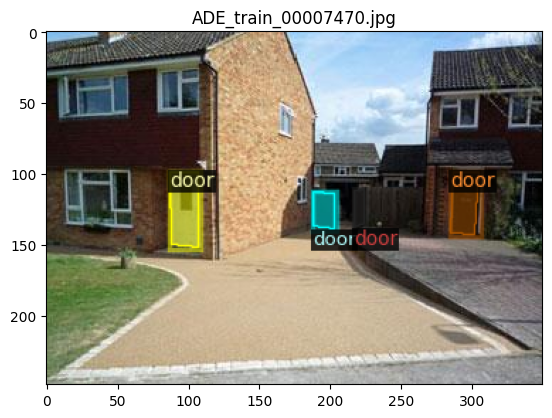

# ADE20K_To_COCO
This tool can convert the latest [ADE20K dataset](https://groups.csail.mit.edu/vision/datasets/ADE20K/) to COCO format, which can be further used in Detectron2 Framework.
As my goal is to build a object level SLAM system, this tool is designed to retrieve information related to target objects.
However, you can always modify it to fit your purposes, and Welcome to pull a request.

Please :star: the repo if you find it useful :full_moon_with_face:


## Usage
1. Install dependencies
    ```
    pip install -r requirements.txt
    ```
2. Run Script
    ```
    python AdeToCOCO.py --datasetDir DATASETDIR --pklPath PKLPATH --objectNames OBJECTNAMES [OBJECTNAMES ...]
    ```
    objectNames: Name of target objects, ex: ["door", "door frame"]\
    pklPath: the path to index_ade20k.pkl provied by ADE20K\
    datasetDir: ADE20K dataset path

## Test Result
Use demo.ipynb to visualize if it works\
\
\


## Citation
```
@misc{
    title  = {ADE20K_To_COCO},
    author = {Tracy Huang},
    url    = {https://github.com/macTracyHuang/ADE20K_To_COCO},
    year   = {2023}
}
```